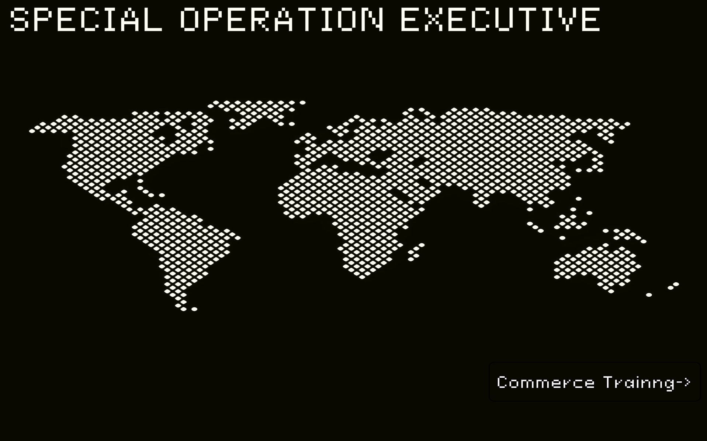
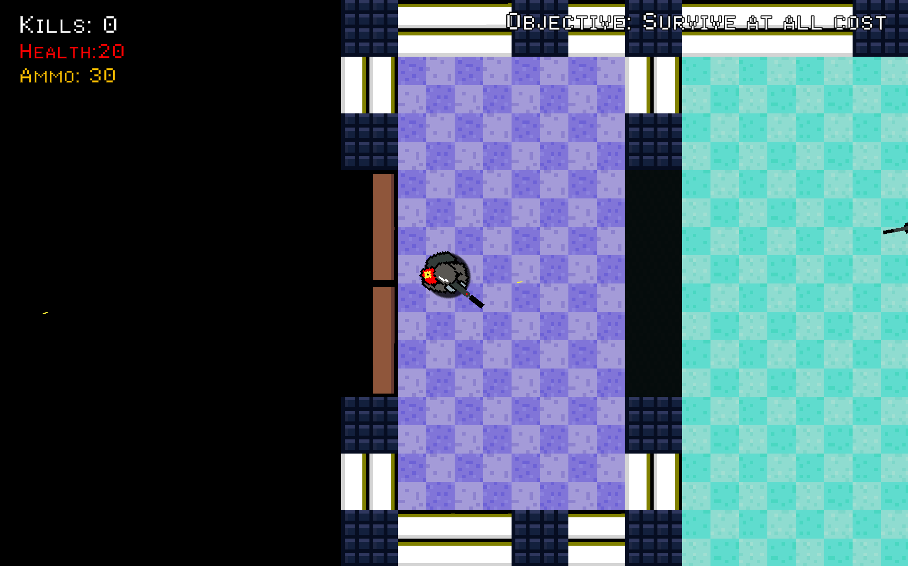
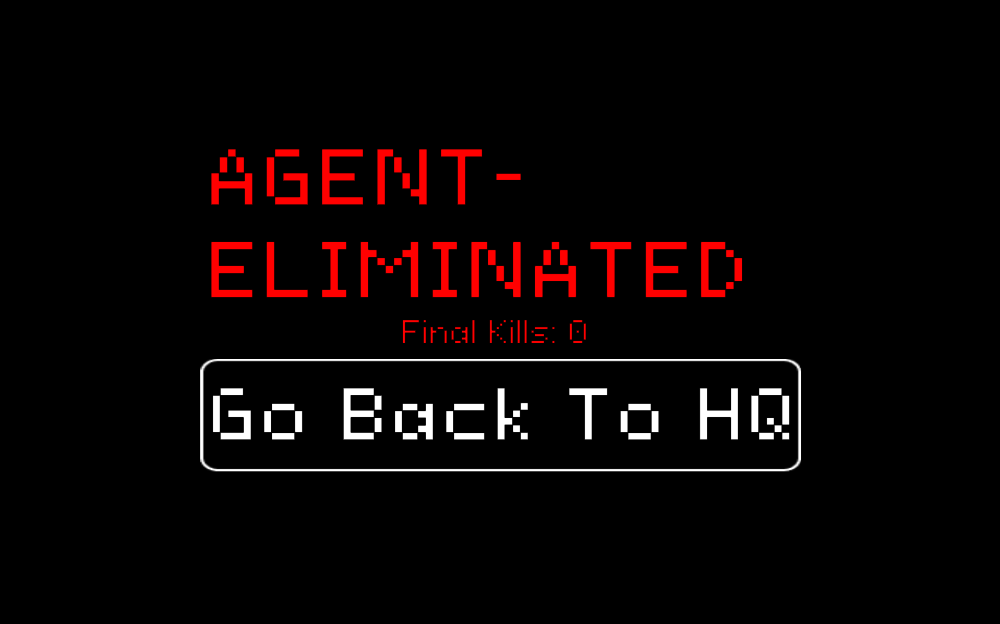

# Game Title
SPECIAL OPERATION EXECUTIVE

## Description
A 2D top-down shooter game built in Unity using the Universal Render Pipeline (URP). 
The game features dynamic health and ammo UI management, visual and audio hit feedback, and enemy wave/spawning mechanics.

##  How to Play
* **W/A/S/D** - Move
* **Left Mouse Button** - Shoot

## Built With
* **Engine:** Unity (Version 2022.3 LTS)
* **Target Platform:** PC / WebGL

##  Gameplay Screenshots




## Project Team
* 68122098-Thu Ta Aung
* 6736501-Sai Thiha Aung

## 🚀 How to Run the Project
1. Clone this repository:
   ```bash
   git clone [https://github.com/u6812098-dotcom/Special-Operation-Executive.git](https://github.com/u6812098-dotcom/Special-Operation-Executive.git)
```
## License
This project is licensed under the **MIT License** - see the [LICENSE](LICENSE) file for details.